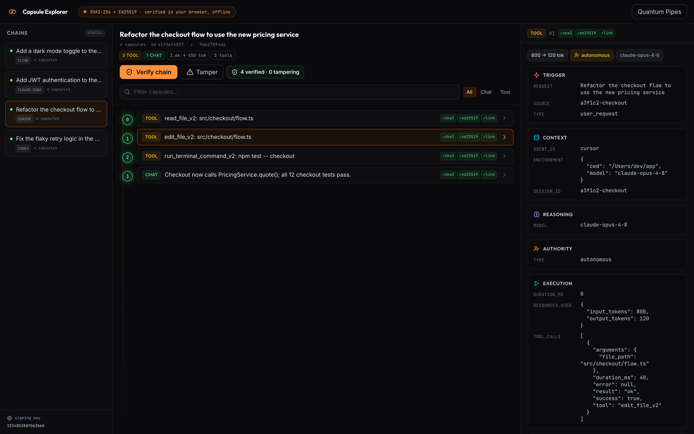
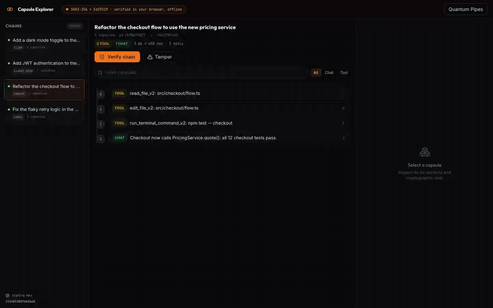

<div align="center">

# 🔍 Capsule Explorer

### Re-verify any AI coding agent's session, in your browser, offline.

A static site that recomputes every SHA3-256 hash and checks every Ed25519 signature of a capsule hashchain, client-side, with no backend and nothing to trust but the math. It is the companion verifier for [**agent-capsule**](https://github.com/quantumpipes/agent-capsule), which seals **Claude Code, Cursor, Codex, and Cline** sessions into tamper-evident chains.

[](LICENSE)
[](#how-verification-works)
[](docs/how-it-works.md)
[](https://github.com/quantumpipes/agent-capsule)

<br>



<sub>One explorer, every agent. Sessions from Claude Code, Cursor, Codex, and Cline, re-verified in the browser, offline.</sub>

</div>

---

## What it is

Your AI agents edit files, run commands, and make decisions in your repo. [agent-capsule](https://github.com/quantumpipes/agent-capsule) seals each session into a signed, linked chain of records. Capsule Explorer is where you (or anyone you hand a chain to) **prove that chain is intact**.

The whole verification runs **in your browser**, offline:

1. Recompute `SHA3-256` over each capsule's exact `canonical` bytes and compare it to the stored hash.
2. `Ed25519`-verify the signature over the UTF-8 of that hash hex string against the chain's public key.
3. Check `previous_hash` linkage and sequence order, so no record can be deleted, reordered, or inserted.

No network. No backend. No account. Nothing to trust but the math. Audited [`@noble`](https://github.com/paulmillr/noble-hashes) libraries do the crypto. A built-in **tamper test** flips one byte and scrolls straight to the break, so you can watch the chain catch it.

> Verify, never trust. You are never asking anyone to believe you. You are handing them the proof and the code that checks it.

## See it

<div align="center">



<sub>Verify the chain (every check turns green), then tamper with one capsule. Verification breaks at the exact record, and every link after it.</sub>

</div>

## Quickstart

```bash
npm install
npm run export      # regenerate public/data/chains from ~/.agent-capsule/chains
npm run dev         # http://localhost:4840
```

`npm run export` runs `python3 scripts/export_chains.py`, which needs Python 3 with PyNaCl (`pip install PyNaCl`). It reads `~/.agent-capsule/chains/*/*.db` by default. Point it elsewhere with `--db PATH` or `--glob PATTERN`. From the agent-capsule package you can run the equivalent: `agent-capsule export --out public/data/chains`.

No chains yet? Seal a session first with [agent-capsule](https://github.com/quantumpipes/agent-capsule), then run `npm run export` again.

## How verification works

Three client-side checks, identical to what agent-capsule's CLI does, run entirely in `src/lib/crypto.ts`:

| Check | Mechanism |
|-------|-----------|
| **Hash** | `SHA3-256` over the capsule's `canonical` JSON bytes must equal the stored `hash`. |
| **Signature** | `Ed25519` verify of the `signature` over the UTF-8 of the `hash` hex string, against the chain's `public_key`. |
| **Link** | each capsule's `previous_hash` must equal the prior capsule's `hash`, and `sequence` must be consecutive from genesis. |

The exported bundle ships the exact `canonical` bytes per capsule, so the browser never re-serializes anything; it hashes the same bytes the signer signed. Full detail, including the `@noble` verify call and the tamper-test behavior, is in [docs/how-it-works.md](docs/how-it-works.md). The on-the-wire byte format is pinned in agent-capsule's [wire-format.md](https://github.com/quantumpipes/agent-capsule/blob/main/docs/wire-format.md).

## Tool-agnostic

A capsule is a capsule, whatever produced it. Chains from every agent show up side by side in the rail, each tagged with its tool:

```
~/.agent-capsule/chains/claude-code/*.db
~/.agent-capsule/chains/cursor/*.db
~/.agent-capsule/chains/codex/*.db
~/.agent-capsule/chains/cline/*.db
```

The exporter namespaces each chain id by tool (`<tool>-<session>`) and the rail renders a badge per tool. The same crypto verifies all of them.

## Data flow

```
~/.agent-capsule/chains/<tool>/*.db    (per-session chains, written by agent-capsule)
   |                                    tool = claude-code | cursor | codex | cline
   v
scripts/export_chains.py               (reads SQLite -> JSON; includes the exact
   |                                    canonical bytes + the Ed25519 public key)
   v
public/data/chains/index.json          (chain summaries + public key + tools)
public/data/chains/<chain-id>.json     (per chain, loaded on demand)
   v
src/lib/data-source.ts -> src/lib/crypto.ts (in-browser verify) -> Explorer.tsx
```

## Static vs live modes

| Mode | When | Behavior |
|------|------|----------|
| **static** (default) | `PUBLIC_CAPSULE_API` unset | Fetches the exported JSON from `/data/chains/`. Fully air-gapped, no backend, ships with the static build, and does the crypto in the browser. The tamper test is available here. |
| **live** | `PUBLIC_CAPSULE_API` set to a server base URL | Reads chains from that server and delegates verification to its `/v1/capsules/verify-chain` endpoint (client-side crypto needs the canonical bytes the static export carries). |

Static mode is the default and the one you want for handing a chain to someone with nothing but a browser.

## Deploy

The site builds to static (`npm run build` writes `dist/`) and deploys to Cloudflare Pages or any static host:

```bash
npm run build       # -> dist/
npm run deploy      # build + wrangler deploy (Cloudflare)
```

The exported bundle in `public/data/chains/` is what ships. See [docs/deploying.md](docs/deploying.md) for hosting, refreshing the bundle, and the privacy note.

## Tests

```bash
npm run build && npm test
```

| Test | What it asserts |
|------|-----------------|
| `verify.test.ts` | recomputes SHA3-256 + Ed25519 over the **real exported chains**, asserts every chain verifies, a one-byte tamper breaks at the exact index, and a wrong public key is rejected. |
| `build-integrity.test.ts` | the discovery and security surface: CSP plus immutable caching, canonical plus JSON-LD plus Open Graph. |

## Where the chains come from

Capsule Explorer only verifies. The chains are produced by [**agent-capsule**](https://github.com/quantumpipes/agent-capsule), one tool that seals Claude Code, Cursor, Codex, and Cline sessions into tamper-evident hashchains at `~/.agent-capsule/chains/<tool>/<session>.db`. The private signing key never leaves your machine; only the public key ships in the bundle, so anyone can verify and no one can forge.

- [agent-capsule README](https://github.com/quantumpipes/agent-capsule)
- [Wire format](https://github.com/quantumpipes/agent-capsule/blob/main/docs/wire-format.md): the exact canonical JSON, hashing, and signature scheme.

## License

[Apache License 2.0](LICENSE). Copyright 2026 Quantum Pipes Technologies, LLC.

<div align="center">

**If a verifier that trusts nothing but the math sounds useful, [star the repo](https://github.com/quantumpipes/capsule-explorer) and re-verify your next session.**

</div>
